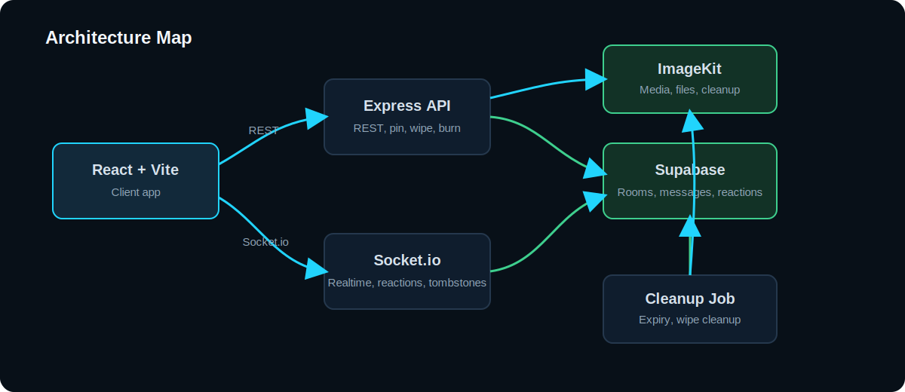
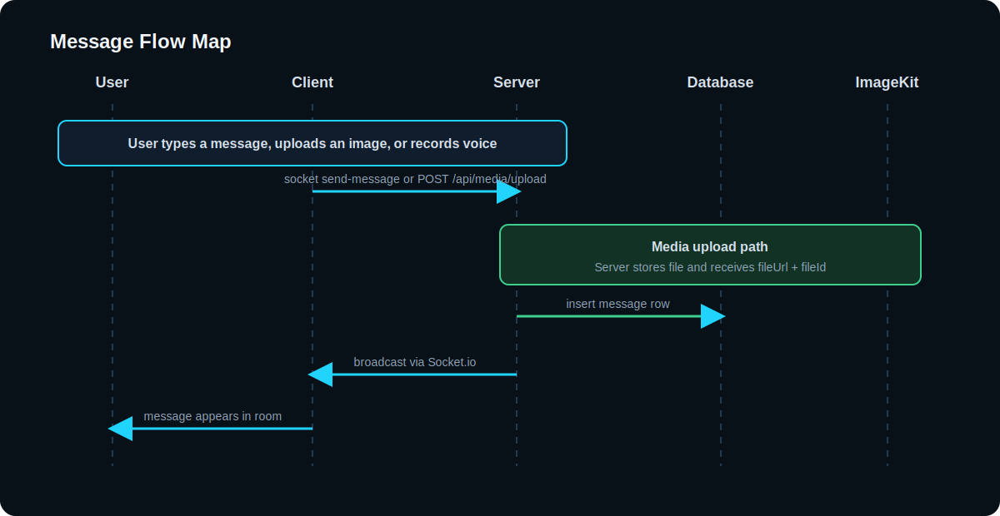
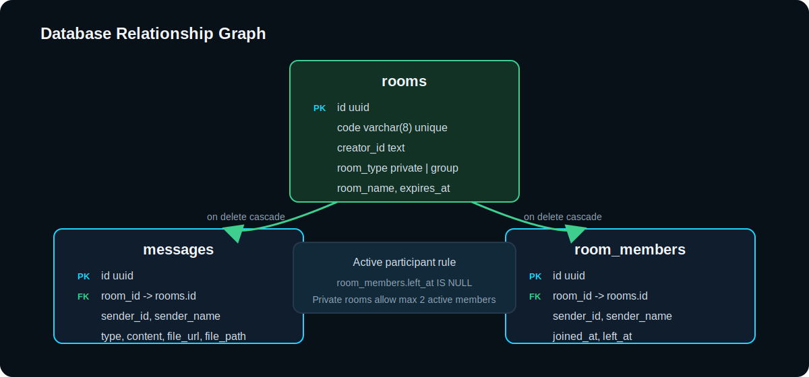

# NullChannel

[](https://react.dev/)
[](https://www.typescriptlang.org/)
[](https://vite.dev/)
[](https://expressjs.com/)
[](https://socket.io/)
[](https://supabase.com/)
[](https://imagekit.io/)
[](https://null-channel-client.vercel.app/)
[](https://nullchannel.onrender.com/api/health)
[](https://nullchannel.onrender.com/api/health)

Short-lived, real-time channels with no signup.

NullChannel is a temporary chat system for private and group rooms. Users create or join an 8-character code, chat in real time, send image or voice media, and let the room expire on a timer with automatic cleanup.



## Live Links

| Link | URL |
| --- | --- |
| Live app | [https://null-channel-client.vercel.app](https://null-channel-client.vercel.app/) |
| Backend API | [https://nullchannel.onrender.com](https://nullchannel.onrender.com/) |
| Health check | [https://nullchannel.onrender.com/api/health](https://nullchannel.onrender.com/api/health) |
| Database health | [https://nullchannel.onrender.com/api/health/db](https://nullchannel.onrender.com/api/health/db) |
| Repository | [https://github.com/Arbab-ofc/NullChannel](https://github.com/Arbab-ofc/NullChannel) |

## Project Map

| Area | What it does | Main files |
| --- | --- | --- |
| Frontend | Landing page, room join/create flow, chat UI, voice recording, participant list | `client/src/pages/*` |
| Backend | REST APIs, validation, room lifecycle, message handling, cleanup | `server/src/controllers/*`, `server/src/services/*` |
| Realtime | Socket room join, typing indicator, live message broadcast, tombstones | `server/src/sockets/*` |
| Storage | Room metadata, messages, memberships, cleanup lifecycle | Supabase PostgreSQL |
| Media | Image and voice upload plus deletion | ImageKit |

## Architecture



## Product Snapshot

| Signal | Value |
| --- | --- |
| Auth model | Anonymous, no account signup |
| Room types | Private and group |
| Room code length | 8 characters |
| Media types | Text, image, voice |
| Expiry options | 15 min, 1 hour, 6 hours, 24 hours |
| Cleanup | Cron plus manual protected endpoint |
| Realtime | Socket.io room broadcast |

## Key Features

| Feature | Details |
| --- | --- |
| Anonymous rooms | No account required. Users join with a sender ID and display name. |
| Private and group rooms | Room type can be `private` or `group`. |
| Expiry presets | 15 min, 1 hour, 6 hours, 24 hours. |
| Real-time chat | Socket.io broadcast for messages, typing, delete events, join/leave, expiry. |
| Text, image, voice | Media upload is supported through the backend and ImageKit. |
| Typing indicator | Live typing state with timeout cleanup. |
| Participant list | Active members are shown in the chat sidebar. |
| Copy feedback | Toasts for invite and room code copy actions. |
| Message deletion | Users can delete their own messages, and tombstones show who deleted them. |
| Message editing | Users can edit their own text messages for 2 minutes after sending. |
| Room termination | Creator can terminate the room and trigger full cleanup. |
| Expiry cleanup | Expired rooms are deleted by cron and via cleanup endpoint. |
| Loading states | Skeletons and loading signals are used across the UI. |

## Message Flow



## Data Model

| Table | Purpose |
| --- | --- |
| `rooms` | Room code, creator, type, room name, expiry timestamp |
| `messages` | Text, image, and voice message records |
| `room_members` | Membership, display name, join/leave state |



## API Surface

| Method | Endpoint | Purpose |
| --- | --- | --- |
| `POST` | `/api/rooms` | Create a room |
| `GET` | `/api/rooms/:code` | Fetch a room by code |
| `GET` | `/api/rooms/:code/messages` | List room messages |
| `PATCH` | `/api/rooms/:code/messages/:messageId` | Edit your own text message within 2 minutes |
| `DELETE` | `/api/rooms/:code/messages/:messageId` | Delete a message |
| `GET` | `/api/rooms/:code/participants` | List active participants |
| `POST` | `/api/rooms/:code/leave` | Leave a room |
| `POST` | `/api/rooms/:code/terminate` | Terminate a room |
| `GET` | `/api/users/:senderId/rooms` | List active rooms for a sender |
| `POST` | `/api/media/upload` | Upload image or voice media |
| `POST` | `/api/cleanup` | Manual expired-room cleanup |

## Health Checks

| Endpoint | Purpose | Status |
| --- | --- | --- |
| `GET /api/health` | Service uptime and server status | Always available if app is running |
| `GET /api/health/db` | Supabase connectivity check | Returns `200` when DB is reachable, `503` when not |

## Socket Events

| Direction | Event | Purpose |
| --- | --- | --- |
| Client -> Server | `join-room` | Join a socket room after membership is confirmed |
| Client -> Server | `typing` | Send typing signal |
| Client -> Server | `send-message` | Send a chat message payload |
| Server -> Client | `receive-message` | Broadcast a new message |
| Server -> Client | `user-typing` | Broadcast typing status |
| Server -> Client | `message-edited` | Broadcast an edited message update |
| Server -> Client | `message-deleted` | Broadcast a tombstone update |
| Server -> Client | `user-joined` | Broadcast participant join |
| Server -> Client | `user-left` | Broadcast participant leave |
| Server -> Client | `room-expired` | Broadcast room expiry or termination |

## Repository Layout

```text
.
|-- client
|   `-- src
|       |-- components
|       |-- hooks
|       |-- lib
|       `-- pages
|-- server
|   `-- src
|       |-- config
|       |-- controllers
|       |-- middlewares
|       |-- routes
|       |-- services
|       |-- sockets
|       `-- schemas
`-- server/supabase
    `-- schema.sql
```

## Prerequisites

| Requirement | Notes |
| --- | --- |
| Node.js | Modern LTS version recommended |
| npm | Workspaces are used at the repo root |
| Supabase project | Required for database and authless storage layer |
| ImageKit account | Required for image and voice uploads |

## Clone This Project

1. Clone the repository:
   ```bash
   git clone https://github.com/Arbab-ofc/NullChannel.git
   ```
2. Move into the project:
   ```bash
   cd NullChannel
   ```
3. Install dependencies:
   ```bash
   npm install
   ```
4. Create environment files:
   ```bash
   cp client/.env.example client/.env
   cp server/.env.example server/.env
   ```
5. Add your Supabase, ImageKit, and API URL values.
6. Start development:
   ```bash
   npm run dev
   ```

## Environment Variables

### Client

| Variable | Example | Required |
| --- | --- | --- |
| `VITE_API_URL` | `http://localhost:5050` | Yes |

### Server

| Variable | Example | Required |
| --- | --- | --- |
| `PORT` | `5050` | No |
| `NODE_ENV` | `development` | No |
| `CLIENT_URL` | `http://localhost:5173` | Yes |
| `SUPABASE_URL` | `https://xxxx.supabase.co` | Yes |
| `SUPABASE_SERVICE_ROLE_KEY` | `your-service-role-key` | Yes |
| `IMAGEKIT_PUBLIC_KEY` | `public_key` | Yes |
| `IMAGEKIT_PRIVATE_KEY` | `private_key` | Yes |
| `IMAGEKIT_URL_ENDPOINT` | `https://ik.imagekit.io/your-id` | Yes |
| `CLEANUP_SECRET` | `random-secret` | Optional |

## Local Setup

1. Install dependencies:
   ```bash
   npm install
   ```
2. Set client env:
   ```bash
   cp client/.env.example client/.env
   ```
3. Set server env:
   ```bash
   cp server/.env.example server/.env
   ```
4. Fill the server env values for Supabase and ImageKit.
5. Run the app:
   ```bash
   npm run dev
   ```

## Scripts

| Command | What it does |
| --- | --- |
| `npm run dev` | Runs client and server together |
| `npm run dev:client` | Runs the frontend only |
| `npm run dev:server` | Runs the backend only |
| `npm run build` | Builds both workspaces |
| `npm run build:client` | Builds the frontend |
| `npm run build:server` | Builds the backend |
| `npm run lint` | Lints both workspaces |
| `npm run typecheck` | Runs TypeScript checks on both workspaces |
| `npm run test` | Runs backend tests |

## Deployment

### Recommended free setup

| Service | Role |
| --- | --- |
| Vercel | Frontend deployment for `client` |
| Render | Backend deployment for `server` |
| Supabase | Database |
| ImageKit | Media storage |

### Vercel

| Setting | Value |
| --- | --- |
| Root directory | Repo root |
| Config file | `vercel.json` |
| Build command | `npm run build --workspace client` |
| Output directory | `client/dist` |
| Environment variable | `VITE_API_URL=https://nullchannel.onrender.com` |

### Render

| Setting | Value |
| --- | --- |
| Root directory | Repo root |
| Build command | `npm install && npm run build --workspace server` |
| Start command | `npm run start --workspace server` |
| Environment variable | `CLIENT_URL=https://your-vercel-app.vercel.app` |

### Render server env

| Variable | Purpose |
| --- | --- |
| `NODE_ENV=production` | Production mode |
| `CLIENT_URL` | Allowed frontend origin |
| `SUPABASE_URL` | Database connection |
| `SUPABASE_SERVICE_ROLE_KEY` | Backend-only database access |
| `IMAGEKIT_PUBLIC_KEY` | Media service config |
| `IMAGEKIT_PRIVATE_KEY` | Media service config |
| `IMAGEKIT_URL_ENDPOINT` | Media service config |
| `CLEANUP_SECRET` | Protects manual cleanup endpoint |

## Contact

| Platform | Link |
| --- | --- |
| GitHub | [Arbab-ofc](https://github.com/Arbab-ofc) |
| Repository issues | [Open an issue](https://github.com/Arbab-ofc/NullChannel/issues) |
| Live project | [NullChannel](https://null-channel-client.vercel.app/) |

## Operational Notes

| Behavior | Detail |
| --- | --- |
| Room expiry | Expired rooms are cleaned by a cron job every 15 minutes |
| Termination | Creator termination deletes the room and cascades related data |
| Message edit | Text messages can be edited by their sender for 2 minutes |
| Message delete | Message row is removed and media cleanup is attempted for image or voice |
| Leave room | Leave marks membership as left and does not hard-delete history |
| Realtime recovery | Users must rejoin the socket room after session state changes |

## Observability Checklist

| Check | Expected result |
| --- | --- |
| `GET /api/health` | `status: ok` |
| `GET /api/health/db` | `database: connected` |
| Join room | Socket room attaches after membership is confirmed |
| Expiry cleanup | Expired rooms disappear from `rooms`, `messages`, and `room_members` |

## Security Notes

| Topic | Detail |
| --- | --- |
| Encryption | The app does not provide full end-to-end encryption yet |
| Server secrets | Supabase service role and ImageKit private key stay server-side only |
| Validation | Request schemas are enforced with Zod |
| Abuse control | Rate limiting is enabled for room creation, lookup, and uploads |

## Limitations

| Limitation | Detail |
| --- | --- |
| No full E2EE | Messages are not end-to-end encrypted today |
| Free hosting sleep | Render free instances can sleep when idle |
| Dependency on storage | Media files depend on ImageKit availability |

## Roadmap

| Priority | Candidate feature |
| --- | --- |
| High | Message reactions |
| High | Reply and thread support |
| High | Read receipts |
| Medium | Search within room messages |
| Medium | Media fullscreen preview |
| Medium | Room pinning |
| Medium | Voice playback speed controls |
| Low | QR invite sharing |
